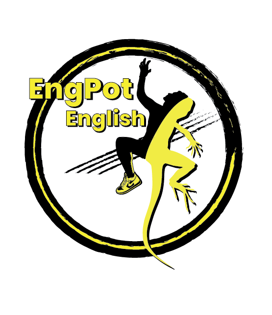

<h1>EngPot English</h1>

  

 

<h1>Table of Contents</h1>
<h2>
    <a href="#h1-what-is-engpot-english">1. What is EngPot English?</a>
</h2>

<h4 style="margin-left: 1rem">Company Vision :</h4>
<ul>
    <li><a class="yellow" href="#vision-students">Students</a></li>
    <li><a class="yellow" href="#vision-teachers">Teachers</a></li>
</ul>

 

<h2>
    <a href="#h1-functionalities">2. Functionalities</a>
</h2>

<ul>
    <li>
        <a class="yellow" href="#h3-authentication-actions">Authentication Actions</a>
    </li>
    <li>
        <a class="yellow" href="#h3-student-actions">Student Actions</a>
    </li>
    <li>
        <a class="yellow" href="#h3-teacher-actions">Teacher Actions</a>
    </li>
</ul>

 

<h2>
    <a href="#h1-technologies-used">3. Which technologies is used to develop EngPot English?</a>
</h2>

<ul>
    <li>
        <a class="yellow" href="#li-nodejs">Node JS</a>
    </li>
    <li>
        <a class="yellow" href="#li-expressjs">Express JS</a>
    </li>
    <li>
        <a class="yellow" href="#li-mongodb">MongoDB (NoSQL)</a>
    </li>
    <li>
        <a class="yellow" href="#li-googleapis">Google APIs</a>
    </li>
    <li>
        <a class="yellow" href="#li-nodemailer">Nodemailer</a>
    </li>
    <li>
        <a class="yellow" href="#li-ejs">EJS (Embedded JavaScript Template Engine)</a>
    </li>
</ul>

   

---

---

   

<h1 id="h1-what-is-engpot-english">What is EngPot English?</h1>

EngPot English is an English Learning Platform for both the students who want to improve their English Language, and for the teachers who work as a freelancer. We are very well aware that learning and teaching English may be challenging from time to time. That is why, we do have a vision as EngPot English.

 

<h2>Company Vision</h2>

 

<h3 id="vision-students">Students</h3>

 

Our main objective is to help students have a more fun way *(as much as possible)* to engage their critical faculties by providing numerous games such as vocabulary games, clause making games, etc. Also we intend to provide them with different articles from **A1 Level** to **C2 Level**. Last but not least, we have a tremendous lesson tracking system powered by **Google** and local mobile carriers. Students can complete, track, and lead their ***lessons*** as well as their ***assignments***.

 

<h3 id="vision-teachers">Teachers</h3>

 

It would be fair to say that, as EngPot English, we know the possible drawbacks when you decide, start, and continue having private lessons where there are several major Language Schools and Institutions everywhere. You may not teach as many students as these organizations, however, you can increase the quality of your teaching method and system. 

Although our future intentions are to help you improve your teaching methods as well, we want to focus on your system first. There are several websites that aim to help students yet there are nearly none for the teachers. Well, now there is one.

In EngPot English, you can improve the quality of teaching process, and you can teach your students in a systematic way. 

  

<h1 id="h1-functionalities">Functionalities</h1>

 

<h3 id="h3-authentication-actions">Authentication Actions :</h3>

 

As a new user on EngPot English:
* You can sign up, sign in, confirm your account, and reset your password.

* You may find more information in Engpot English Tutorials.

<a class="yellow" href="./tutorials/authActions.md">User Tutorials</a>

  

<h3 id="h3-student-actions">Student Actions :</h3>

 

As a student on EngPot English:
* You can keep track of your previous lessons with your personal tutor.
* With our lesson reminders, you never miss or forget a planned lesson or an assignment.
* You can receive, complete, and evaluate your given assignments at any time.
* Reading has a major impact on learning a foreign language, so you need to read a lot. You can find many readings that you are interested in.
  
* You can play games intending to help you learn English, and by playing these games, you earn prizes like a free speaking lesson, or even a free lesson every month.

<a class="yellow" href="./tutorials/studentActions.md">Student Tutorials</a>

  

<h3 id="h3-teacher-actions">Teacher Actions :</h3>

 

As a teacher on EngPot English:
* You can plan your lessons and speaking lessons(if you do speaking lessons of course) with your students.
* You can conclude your lessons and speaking lessons. After concluding, your lesson time and topics will be stored in our database so that you and your teacher will always be able to revise them to remind yourselves.
* You can assign homework to your students with a specific deadline which will be tracked by our system automatically.
* After them completing their homework, you will be notified and you will be able to grade them, with a little side note to contribute their learning process.

* You can manage your payments with our carefully tailored system. While you will be able to be paid by EngPot English in the future(if preferred of course), you need to contact us after getting your payment so that your students' credits can be loaded to their accounts.

<a class="yellow" href="./tutorials/teacherActions.md">Teacher Tutorials</a>

  

<pre>Important Note:</pre>
<code>After planning lessons, concluding lessons, and assigning homework, your student will receive emails to ensure that they are well informed.</code>

  

<h1 id="h1-technologies-used">Which technologies is used to develop EngPot English?</h1>

<pre>EngPot English is a full-stack project developed and maintained by Sertan Soydabaş. </pre>

<h3>There are many technologies behind the scenes, for the main ones:</h3>

<ul>
  
<li id="li-nodejs">Node JS</li>
    <code>Backend of our application is powered by Node JS, which is a popular application development platform. We use Node JS because of its fast processing ability, and its vast community.</code>

 

<li id="li-expressjs">Express JS</li>
    <code>Express JS is a JavaScript framework that has been built to handle HTTP requests, and creating stable servers. It is common to pair Node JS and Express JS in the industry.</code>

 

<li id="li-mongodb">Mongo DB - Mongoose</li>
    <code>As our data store, we employ Mongo DB. Mongo DB is a no-SQL data managing software, which uses a very similar syntax to JavaScript. When used carefully, no-SQL databases can be faster and more reliable than SQL databases. Mongoose, on the other hand, is a JavaScript library to easily manage MongoDB, empowering No-SQL even further.</code>

 

<li id="li-googleapis">Google APIs and Node Mailer</li>
    <code>To be able to handle the teachers' and students' notifications, we needed an email service, which could be easily developed and employed, however, we decided to rely on Google's powerful APIs and a well known mailing library called Node Mailer. With those two technologies, we have ensured that the users mails will be sent, received, and handled safely and quickly.</code>

 

<li id="li-ejs">EJS</li>
    <code>The most challenging aspect of a full-stack application may be rendering actual context for our users. There are a lot of features to be handled unless you use a ready template. We have decided not to use a ready template, instead, we have developed all the skeleton and styling of EngPot English. EJS (Embedded JavaScript Template Engine) is a marvelous library that enable its users to generate HTML content rather easily. We have employed EJS for our application.</code>
</ul>