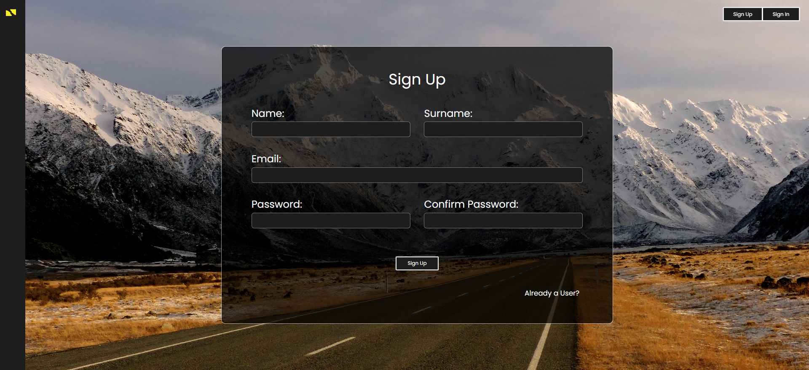
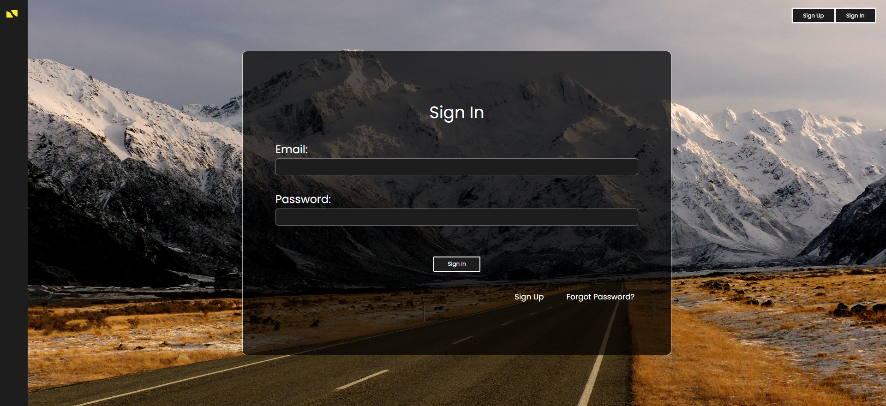
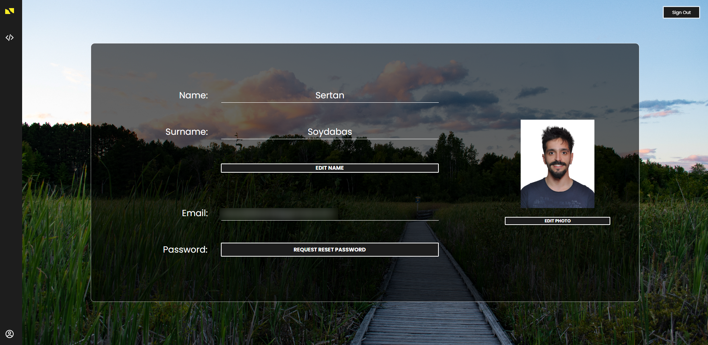

# EngPot English - Auth Actions

## Sign Up

In order to sign up, you need:
``` json
    {
        "name": "Sertan",

        "surname": "Soydabas",

        "email": "dummy-email@mail.com",

        "password": "******",

        "confirmPassword": "******"
    };
```

<br>

<p align="center">
  
</p>

<br>

> Please note that you need to confirm your account after signing up. You can use the mail you receive to confirm your account.

<br>

--- 

<br>

## Sign In

Enter your account information to sign in.
``` json
    {
        "email": "dummy-email@mail.com",

        "password": "******",
    };
```

<br>

<p align="center">
  
</p>

<br>

---

<br>

## User Page

You can navigate yourself to your account page by clicking user account icon at the very bottom of navigation bar.

<br>

What you can do here:

1. **Edit Name and Surname**
 
2. **Request a password change**

3. **Add a profile picture**


<br>

<p align="center">
  
</p>

<br>
