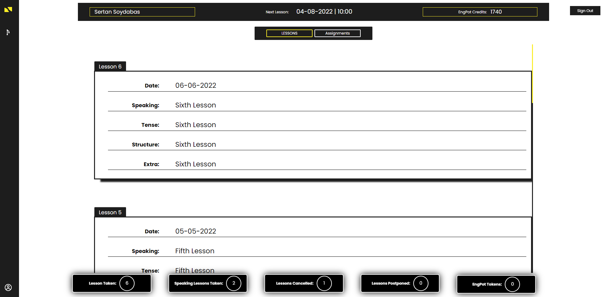
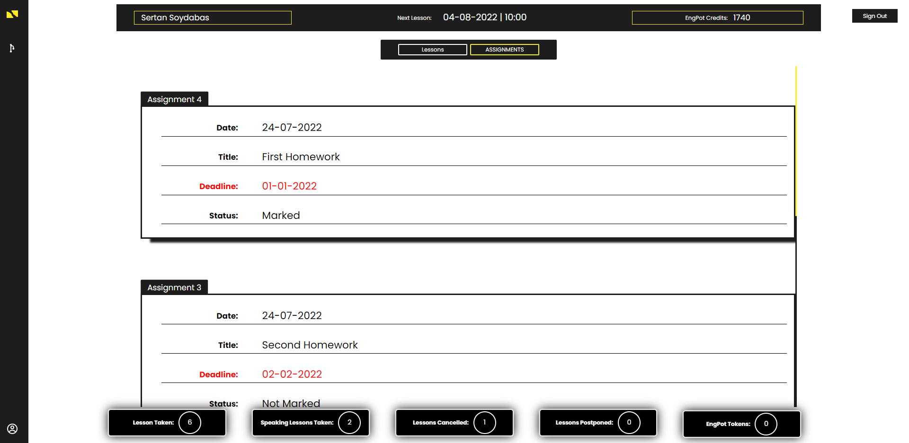
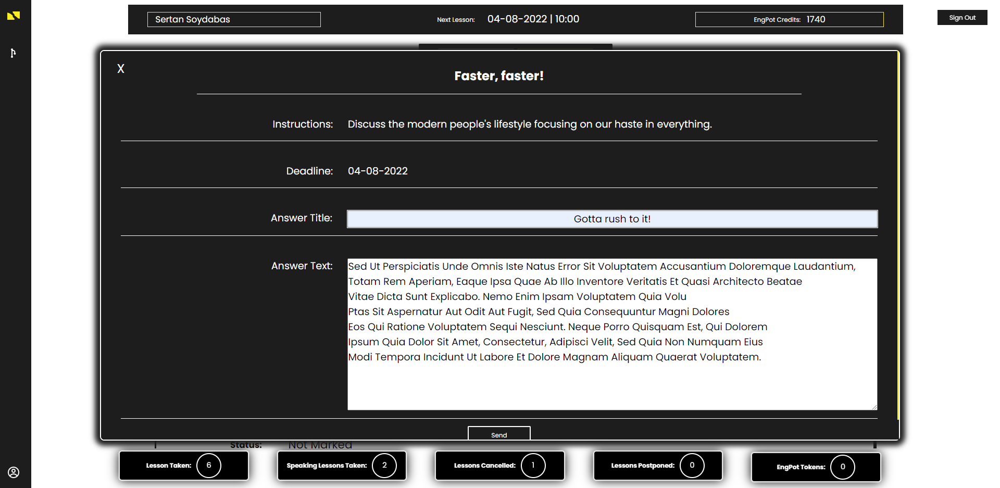
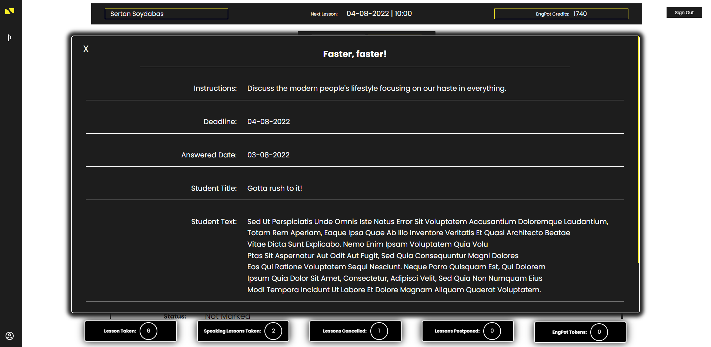
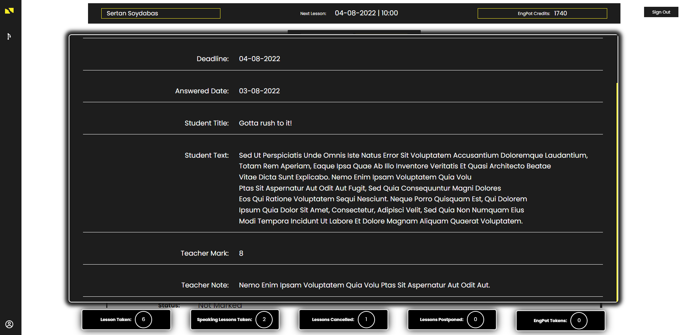

# EngPot English - Student Actions

## Student Page
In Student Page, you can display:

```json
    {
        "name": "Sertan",
        "surname": "Soydabas",
        "nextLessonDate": "04-08-2022",
        "nextLessonTime": "10: 00",
        "currentCredits": "1740",

        "previousLessons": "left toggle button",
        "assignments": "right toggle button",

        "lessonsTaken": "6",
        "speakingLessonsTaken": "2",
        "lessonsCancelled": "1",
        "lessonsPostponed": "0",
        "engPotTokens": "0",
    }
```

<br>

---

<br>
<br>

`Previous Lessons`
<p align="center">
  
</p>

> You can display your previous lessons with relevant information.

<br>
<br>

---

<br>


## Display and Complete Assignments
You can display:

```json
    {
        "assignmentTitle": "Faster, faster!",
        "instructions": "Discuss the modern people's ...",
        "deadline": "04-08-2022",

        "answerTitle": "Gotta rush to it!",
        "answerText": "StudentAnswer...",
    }
```

<br>
<br>

`Assignments`
<p align="center">
  
</p>

> You can display your previous assignments.

<br>


`Do Assignment`
<p align="center">
  
</p>

> If you have not done one yet, you can complete it.

<br>
<br>

---

<br>
<br>

`Display Teacher Response`
<p align="center">
  
</p>

> After your teacher marks it, you can see his/her response.

<br>

`Display Teacher Response`
<p align="center">
  
</p>

> After your teacher marks it, you can see his/her response.

<br>
<br>

[Go Back](../README.md)
