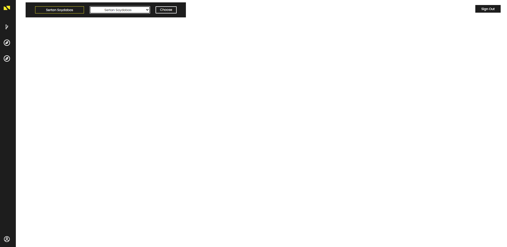
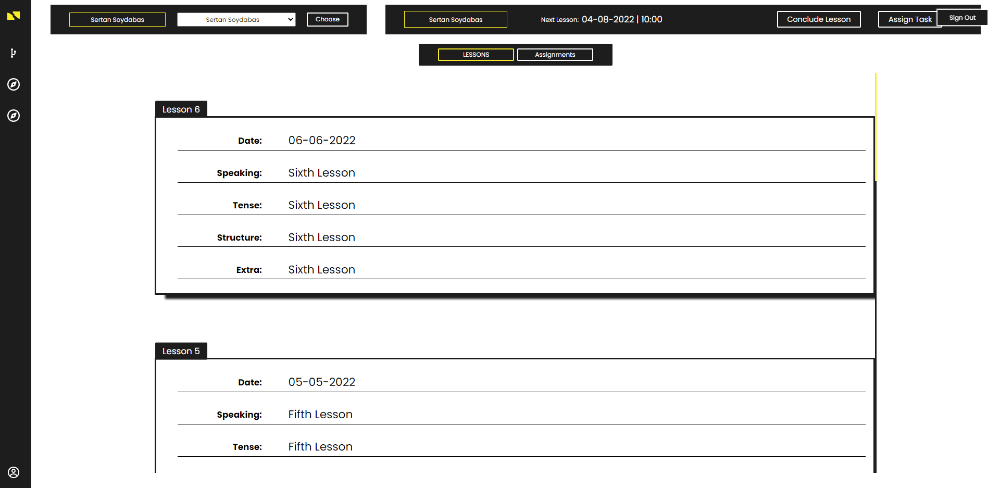
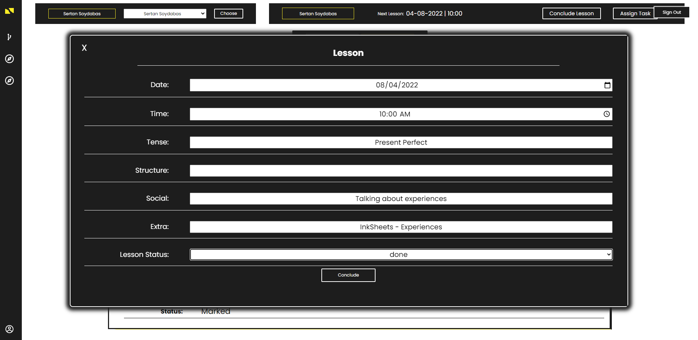
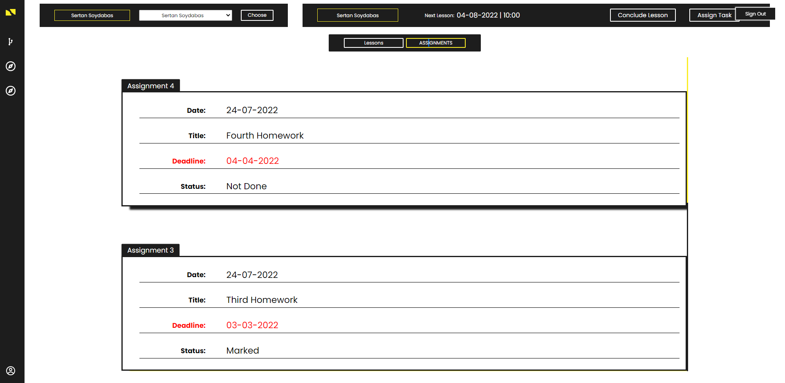
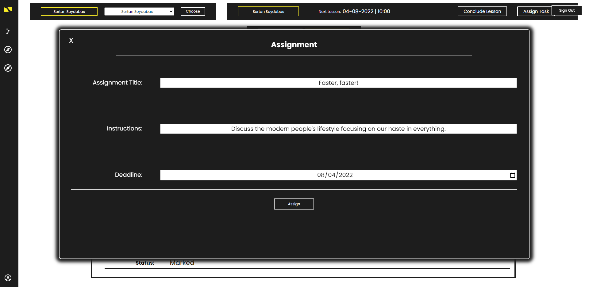
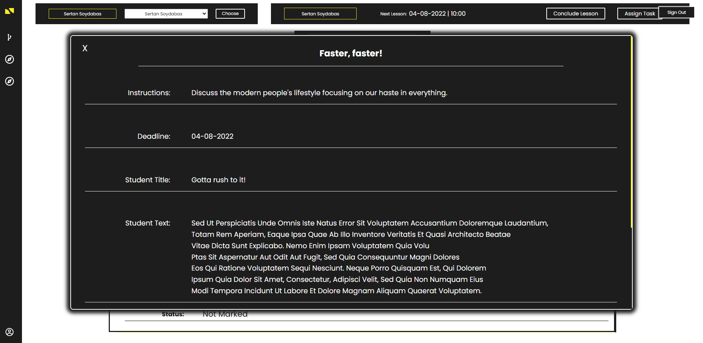

# EngPot English - Teacher Actions

## Teacher Page
In Teacher Page, you can display:

```json
    {
        "name": "Sertan",
        "surname": "Soydabas",
        "yourStudents": "list",

        "studentName": "Sertan",
        "studentSurname": "Soydabas",
        "nextLessonDate": "04-08-2022",
        "nextLessonTime": "10: 00",
        "currentCredits": "1740",

        "firstButton": "plan or conclude lessons",
        "secondButton": "assign tasks",

        "firstToggleMenuButton": "lessons",
        "secondToggleMenuButton": "assignments",
    }
```

<br>
<br>

`Initial Teacher Page`
<p align="center">
  
</p>

> You can choose the student you want to manage here.


<br>
<br>


---

<br>
<br>

`Previous Lessons`
<p align="center">
  
</p>

> You can display your previous lesson with the chosen student.

<br>
<br>

---

<br>
<br>

`Plan or Conclude Lessons`
<p align="center">
  
</p>

> You can plan a lesson with your student. You need to store your topics and lesson time to plan it.

> You can also conclude your planned lesson with an additional field on lesson status - done, postponed, cancelled, ghosted.

<br>
<br>

---

<br>
<br>

`Assignments`
<p align="center">
  
</p>

> You can display your previous assignments with the chosen student.

<br>

---

<br>
<br>

`Assign Tasks`
<p align="center">
  
</p>

> You can assign homeworks to your student.

<br>
<br>

---

<br>
<br>

`Mark Assignment`
<p align="center">
  
</p>

> You can mark your student's assignment if he/she has completed it.

<br>
<br>

[Go Back](../README.md)